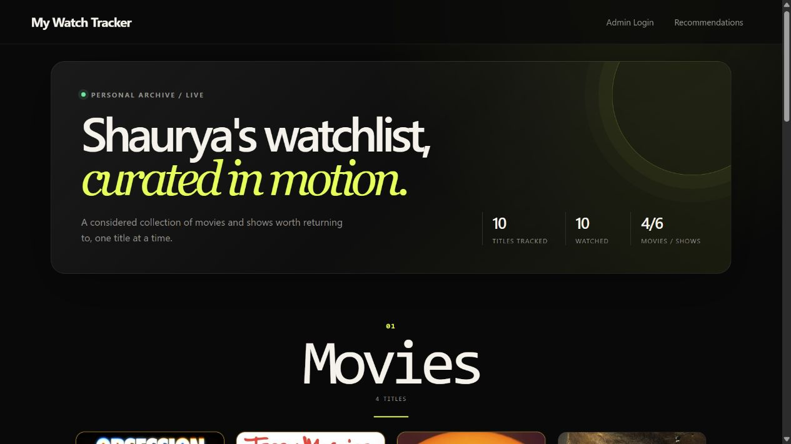
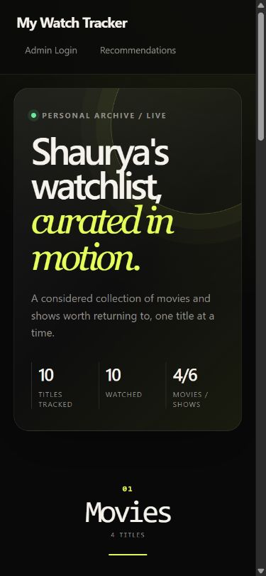

# My Watch Tracker

I built this as a small personal watchlist for movies and TV shows. I wanted
one place to mark what I had watched, keep a list of things I still wanted to
see, and get poster art without entering it by hand. It runs on Flask and
PostgreSQL, uses TMDB for title and poster data, and is deployed as a Python
function on Vercel.

The public watchlist is open to anyone. Only my admin session can add, edit, or
delete entries.

Live deployment: https://movie-tracker-umber-sigma.vercel.app

## Why I built it

The first version was a straightforward CRUD app. The interesting work came
after that: making failed database connections safe, keeping the TMDB API from
being hit without limits, protecting every write route, and making the
recommendations explainable instead of pretending I had enough data for a
serious machine-learning system.

I found the production database connection especially easy to get wrong. The
Vercel deployment needs the Supabase Shared Pooler transaction-mode URL on port
`6543`, with the project-qualified connection identity from Supabase's Connect
settings. The Flask database client uses a five-second connection timeout and
turns database failures into safe responses instead of exposing driver errors.

The other awkward part was the recommendation cold start. My watchlist is too
small for a meaningful production-quality metric, so I store TMDB IDs, media
types, and genre IDs and use a deterministic content-based baseline. It is
useful and inspectable, but I do not describe it as an evaluated ML system.

If I started again, I would settle the migration and production connection
workflow earlier, before spending as much time on UI polish. If this grew
beyond a personal app, I would also move authentication and row permissions to
a real multi-user identity system, and use shared infrastructure for TMDB
caching and rate limiting instead of relying on one warm serverless instance.

## What it does

- I can rate entries from 1 to 10 with a structured score panel and strength bar.
- Exact 10/10 entries get a gold card outline, gold score panel, and `Top tier` label.
- I can mark an entry as **Watched** or **Want to Watch**.
- Movies and TV shows appear in separate sections with numbered editorial headings.
- I can edit ratings and status, or delete entries from the authenticated admin view.
- Anyone can browse the public watchlist; the admin area is password-protected.
- The UI includes progressive loading skeletons, responsive layout rules, and reduced-motion support.
- The recommendations page uses stored TMDB genre metadata to produce deterministic, explainable suggestions.

## What I have checked in production

My current recorded live probe was on **2026-08-16** against production
deployment `dpl_AD1kFbNeNY3A6WrkurMKRpJLVHge` at commit
`38d462dfd102000927a8b9f1d59aa7bc7810142c` on `main`. It covered:

- `/healthz`: HTTP 200 with `{"status":"ok"}`.
- `/`: HTTP 200.
- `/login`: HTTP 200.
- `/recommendations`: HTTP 200.
- Anonymous `POST /add`: HTTP 302 to `/login`.
- The live login response set a `Secure`, `HttpOnly`, `SameSite=Lax` session
  cookie.

The current audit did not run an authorized add/edit/delete fixture because no
production admin credential was supplied. The older 2026-07-27 authorized
add/delete fixture remains historical evidence, not current proof.

The Supabase project is healthy and the database-backed routes respond, but the
exact encrypted Vercel pooler identity was not read during this audit. Remote
migration history now matches the six tracked migration versions, including
the API-grant lockdown and live-schema alignment migrations. Supabase security
and performance advisors are clean. The admin password is stored as
`ADMIN_PASSWORD_HASH`; neither secret is tracked in this repository. The full
probe is recorded in
[`docs/verification.md`](docs/verification.md).

## Production visuals

These snapshots were captured from the canonical Vercel deployment on
**2026-08-16**. They show the public watchlist at the recorded production
commit `38d462dfd102000927a8b9f1d59aa7bc7810142c`; they are visual evidence of
the deployed UI, not evidence that the local audit branch has been deployed.





## Current limits

- This is a single-admin Flask session, not a multi-user account system. I have not integrated Supabase Auth or RLS.
- The recommender is a deterministic content-based baseline. It uses TMDB and stored genre metadata, falls back to popular picks when the history is sparse, and does not yet have a real production precision metric.
- TMDB caching and rate limiting are limited to each warm serverless instance. Global enforcement would need shared state.
- My usage counters record aggregate successful public views, adds, and recommendation views. They do not count registered users or identify visitors.
- Public desktop/mobile rendering, labels, landmarks, visible focus styling,
  and recommendation explanations were checked in a browser against the
  current production deployment. A manual admin-session keyboard,
  screen-reader, modal Escape, and focus-return pass is still open.

## Privacy and measurement

I do not use an external analytics provider. The app stores only daily counts
for successful public views, adds, and recommendation views. It does not store
IP addresses, user agents, referrers, account IDs, or browser identifiers.

For **2026-07-27**, the production `public.usage_daily` table contained 22
public views, 1 successful add, and 1 recommendation view. I read those values
with a read-only aggregate query. They describe activity events, not unique
people or registered users.

### Offline recommendation benchmark

On **2026-08-08**, I ran a reproducible offline benchmark using 585 real TMDB
records: a synthetic 200-entry watchlist, a chronological 160/40 train/holdout
split, and a 400-item candidate pool containing 40 held-out positives and 360
unseen benchmark negatives.

| Metric | Result |
|---|---:|
| `precision@1` | `0.000` |
| `precision@5` | `0.000` |
| `precision@10` | `0.000` |

This is a synthetic offline baseline, not a production or user-satisfaction
metric. The benchmark negatives are unseen titles rather than verified
dislikes, and TMDB popularity pages overrepresent visible and recent titles.
The result is still useful: this simple feature-union recommender did not
recover any held-out titles in the top 10 for this split.

## Tech stack

| Layer | Tool |
|---|---|
| Language | Python 3.10+ |
| Framework | Flask |
| Database | PostgreSQL (Supabase) |
| Cover art | TMDB API (free) |
| Hosting | Vercel (Python function) |
| Runtime | Vercel Python runtime |

## Local setup

```bash
git clone https://github.com/YOUR_USERNAME/movie-tracker.git
cd movie-tracker

python -m venv venv
source venv/bin/activate  # Windows: venv\Scripts\activate

pip install -r requirements.txt
```

Run the automated checks with:

```bash
python -m pytest
```

I pin the direct dependencies in `requirements.txt`; the update process is in
[`docs/dependency-update.md`](docs/dependency-update.md).

Copy `.env.example` to `.env` and replace the placeholders with local secrets
or service credentials. I keep `.env` untracked; production values belong in
Vercel's encrypted environment variables.

`ADMIN_PASSWORD_HASH` must contain a Werkzeug password hash, not the plaintext
admin password. Generate one interactively with:

```bash
python -c "from getpass import getpass; from werkzeug.security import generate_password_hash; print(generate_password_hash(getpass('Admin password: ')))"
```

To rotate credentials, generate a new hash, replace `ADMIN_PASSWORD_HASH` in
the local or Vercel environment, and redeploy. I do not retain or document the
old plaintext password.

The Flask session cookie is HTTP-only and `SameSite=Lax`. Vercel and other
production environments also set the cookie's `Secure` flag. Rotating
`SECRET_KEY` invalidates signed sessions and makes administrators log in again.

For Vercel, `DATABASE_URL` should use the Supabase Shared Pooler
transaction-mode connection on port `6543`. The five-second connection timeout
is deliberate because a serverless request should fail promptly when the
database is unavailable.

TMDB searches use a five-minute in-process cache and limit uncached searches to
30 requests per minute per warm application instance. That protects the quota
on one instance; a shared cache and rate-limit store would be needed for a
scaled deployment.

## TMDB attribution and data boundaries

This project uses the [TMDB API](https://www.themoviedb.org/) but is not
endorsed or certified by TMDB. TMDB supplies title metadata and poster images;
I never expose `TMDB_API_KEY` to the browser.

Search and discovery responses are cached for five minutes per warm instance.
When I add an entry, I persist the selected TMDB ID, media type, and genre IDs
for recommendations. Existing entries are not silently refreshed, so stale or
missing metadata can leave the recommender in its documented cold-start state.
See TMDB's [API FAQ](https://developer.themoviedb.org/docs/faq) for the current
attribution and API-use requirements.

## Database security

The Flask server is currently the mutation boundary for this app. I have not
added a tested RLS policy that matches the Flask session and direct-Postgres
access path, so I do not present database-level row authorization as a feature.

For the remaining work and the evidence behind these decisions, see the
[`BACKLOG.md`](BACKLOG.md),
[`docs/architecture.md`](docs/architecture.md),
[`docs/local-development.md`](docs/local-development.md),
[`docs/operations.md`](docs/operations.md), and
[`docs/usage-measurement.md`](docs/usage-measurement.md).
