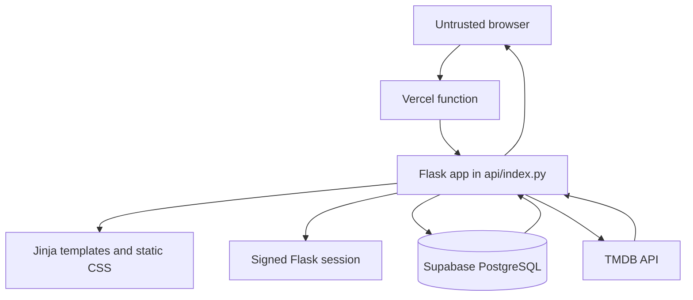

# Architecture

## Request and data flow

Public requests render the watchlist from PostgreSQL. The `/healthz` endpoint
does not access PostgreSQL or TMDB. The login route verifies the configured
Werkzeug password hash and establishes a signed Flask session; it does not
create a database identity. Add, edit, and delete routes require that session
and a session-bound CSRF token.

The add flow validates the submitted title, type, status, and rating, then the
server searches TMDB with `TMDB_API_KEY`, normalizes the selected metadata, and
stores the entry through the shared database transaction context. The key is
never sent to the browser. Recommendation requests read stored entries, fetch
cached popular movie and TV candidates from TMDB discovery, rank them with the
content-based baseline in `recommendations.py`, and render escaped Jinja
output.

## Trust boundaries

- Browser input, cookies, and form submissions are untrusted. Templates escape
  displayed values; mutating forms include CSRF tokens; server-side allowlists
  and length limits remain authoritative.
- The Flask/Vercel runtime is the application trust boundary. It holds the
  session signing key, password hash, database URL, and TMDB API key, and is
  responsible for authorization and safe error messages.
- PostgreSQL is reached with a direct `psycopg2` connection over TLS. The
  current design does not claim Supabase RLS because the database identity is
  the server connection rather than the Flask session. Transactions commit on
  success and roll back and close resources on failure.
- TMDB is an external dependency. Requests have bounded timeouts, response
  validation, server-side key use, five-minute warm-instance caching, and
  per-warm-instance rate limiting. TMDB data and availability are not treated
  as authoritative application state.

## Key tradeoffs and failure modes

The custom single-admin session fits a personal watchlist and keeps the current
database boundary small. Its accepted tradeoff is that it is not a multi-user
identity system: adding accounts would require an identity model, session
mapping, and matching database policies. The direct database connection keeps
the Flask code simple but depends on a provider-compatible pooler URL for
Vercel and does not provide serverless-global connection pooling by itself.

Database failures become a safe HTTP 503 for public reads or a retryable flash
message for authorized mutations. TMDB timeout, network, authentication,
rate-limit, and malformed-response failures are categorized into safe messages.
Recommendation failures render an error state; missing or sparse stored
metadata uses the deterministic popular-candidate fallback. The current
content recommender is an explainable binary-feature baseline, not a trained
or claimed deep-learning system.
