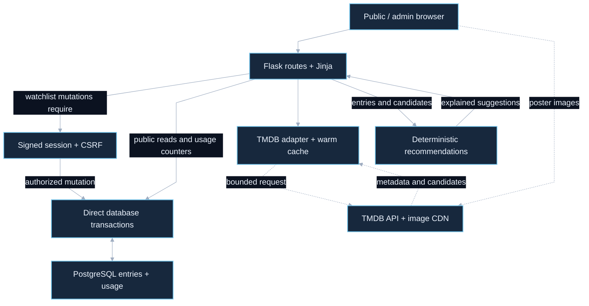

# Movie Tracker: architecture case study

A Flask watchlist combines public browsing, protected admin writes and explainable recommendations.

Source snapshot: `f2209af2891c9f5c9df3e03de8399419e2b51897`. Reviewed on **2026-10-03**. This describes the selected committed source, excluding unrelated uncommitted work in the canonical checkout. It is not a runtime, provider, deployment or security certification. GitHub initially returned HTTP 422 because this SHA had not yet been published; on 2026-10-04 the exact snapshot was published at [this commit](https://github.com/icecold009/movie-tracker/commit/f2209af2891c9f5c9df3e03de8399419e2b51897). Relative source links resolve in the repository, and the exported bundle includes the referenced source files for offline inspection.

## Overview

[Editable Mermaid](overview.mmd). Solid edges show the core flow; dashed edges show optional or separately invoked paths. Diagram connections summarize control/data flow rather than a complete import graph.

## Main flow

Flask serves Jinja pages and static browser interactions. Public page views load entries and increment daily usage aggregates through the shared database layer; watchlist mutations require a signed session and CSRF validation. The database layer uses direct psycopg2 transactions to PostgreSQL. TMDB supplies bounded metadata and popular candidates through its adapter; browsers load poster images directly from its image CDN. The structured diagnostics logger writes log records, while the route layer invokes database usage counters. Deterministic content features rank unseen candidates and return explanations, with popular fallback when watch history is sparse.

## Engineering decision

Use a deterministic content-based recommender for a small watchlist. Feature overlap, stable ranking and explanation are inspectable without claiming enough data for trained ML. A single-admin signed session fits the product scope, but does not create a Supabase database identity or a multi-user authorization system.

## Source map

| Component | Review path |
| --- | --- |
| Public / admin browser | [templates/index.html](../../templates/index.html) |
| Flask routes + Jinja | [api/index.py](../../api/index.py) |
| Signed session + CSRF | [api/index.py](../../api/index.py) |
| Direct database transactions | [database.py](../../database.py) |
| PostgreSQL entries + usage | [supabase/migrations](../../supabase/migrations) |
| TMDB adapter + warm cache | [tmdb.py](../../tmdb.py) |
| TMDB API + image CDN | [tmdb.py](../../tmdb.py) |
| Deterministic recommendations | [recommendations.py](../../recommendations.py) |

## Boundaries and limitations

- The Flask session is application authorization; it is not Supabase Auth and is not mapped to per-user RLS. Tracked grants/migrations and hosted policy state are separate evidence.
- TMDB cache and quota controls are per warm instance, not globally distributed. PostgreSQL connection/pooler identity and live admin mutations were not checked here.
- No production recommendation-quality metric, deployment health or current usage claim is established by this diagram.

## GitDiagram provenance

GitDiagram draft dated 2026-10-03 and existing docs/architecture.md were inspected. The compact overview distinguishes Flask authorization, direct database access and deterministic ranking.

[GitDiagram reference](https://gitdiagram.com/icecold009/movie-tracker) · [Repository](https://github.com/icecold009/movie-tracker)

The compact overview is a source-reviewed adaptation authored for this snapshot and rendered locally, not an unmodified GitDiagram export. The existing [architecture and trust-boundary notes](../architecture.md) remain the detailed reference.

## Interview explanation

> The watchlist is a single-admin Flask app, so write authorization lives in its signed session and CSRF checks. I use direct PostgreSQL transactions and a deterministic recommender for the small history. I would need a new identity model and shared quotas before calling it a multi-user platform.

## Verification and refresh

Documentation-only acceptance: validate every relative source link and snapshot-specific diagram link, render Mermaid, inspect the dark PNG for readability, inspect the complete diff, and obtain a bounded Jev diff review. The repository proposal contains no new binary images; separately delivered PNG previews are independently checked because Jev reviews text. Results and Jev coverage are recorded in this task’s delivery report rather than treated as application test evidence.

After an architecture change, inspect the new source, update this snapshot identifier, regenerate the overview from Mermaid, and recheck links and image appearance. Keep planned integrations explicitly separate from implemented paths.

## Review status

The architecture documentation is published on a feature branch; no PR or merge is included. The proposed repository changes are text only, including embedded Mermaid; PNG previews are separate delivery outputs. Source claims describe this committed snapshot. The coverage register accounts for tracked paths and does not prove every execution path or deployed behavior. Jev review remains advisory, with verification scope and limits recorded below.

## Detailed coverage

See [the subsystem diagram and complete tracked-file register](coverage.md) and [editable detail Mermaid](detail.mmd). This supplement records recovery, optional services, delivery boundaries and original-checkout drift beyond the overview.

[Documentation verification record](verification.md).
