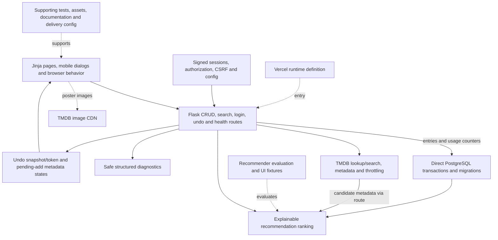

# Subsystem coverage register

Snapshot: `f2209af2891c9f5c9df3e03de8399419e2b51897`. The overview is intentionally compact; this detail layer accounts for the selected Git-tracked tree. Inventory coverage is not proof of every behavior, dynamic dependency, ignored file or deployed system. Nodes group modules rather than reproducing every function. Credentials, local datasets and generated dependencies are excluded.

## Flow and boundary notes

- Login/logout and mutations use session/authorization/CSRF checks. Add/edit/delete and token-bound undo operate through server routes and database transactions. Pending-add/metadata failure states retain useful form recovery.
- TMDB search and enrichment cross a network boundary; search throttling is per warm application instance. Recommendations use the committed deterministic ranking and explanations, not an AI provider.
- Structured diagnostics, health and daily usage aggregates differ from deployment monitoring proof. Supabase migrations define database grants/schema, while Flask accesses PostgreSQL directly. Evaluation and browser fixture scripts are tooling; Vercel config is a deployment definition.

## Original checkout differences

The original checkout was clean at audit.

## File accounting

60 tracked paths, each assigned exactly once below. Supporting items remain explicit without becoming runtime services. Root dependency/build/CI files and otherwise unassigned support files are in DELIVERY; that bucket must be inspected for misclassified runtime modules.

### UI: Jinja pages, mobile dialogs and browser behavior (7)

- `static/app.js`
- `static/style.css`
- `templates/base.html`
- `templates/index.html`
- `templates/login.html`
- `templates/partials/site_footer.html`
- `templates/recommendations.html`

### API: Flask CRUD, search, login, undo and health routes (1)

- `api/index.py`

### AUTH: Signed sessions, authorization, CSRF and config (1)

- `config.py`

### DB: Direct PostgreSQL transactions and migrations (8)

- `database.py`
- `supabase/migrations/20260726165817_add_entries_constraints.sql`
- `supabase/migrations/20260727043725_add_recommendation_features.sql`
- `supabase/migrations/20260727051707_add_usage_daily.sql`
- `supabase/migrations/20260727051928_restrict_usage_daily_roles.sql`
- `supabase/migrations/20260816060348_lock_down_entries_api_grants.sql`
- `supabase/migrations/20260816090126_align_entries_schema.sql`
- `supabase/migrations/20260822000000_add_display_metadata.sql`

### META: TMDB lookup/search, metadata and throttling (1)

- `tmdb.py`

### RANK: Explainable recommendation ranking (1)

- `recommendations.py`

### OBS: Safe structured diagnostics (1)

- `observability.py`

### EVAL: Recommender evaluation and UI fixtures (3)

- `scripts/evaluate_recommender.py`
- `scripts/ui_browser_matrix.cjs`
- `scripts/ui_fixture_server.py`

### RUN: Vercel runtime definition (1)

- `vercel.json`
### TEST (14)

- `tests/conftest.py`
- `tests/test_app.py`
- `tests/test_auth.py`
- `tests/test_authorization.py`
- `tests/test_database.py`
- `tests/test_loading_ui.py`
- `tests/test_metadata_state.py`
- `tests/test_mutations.py`
- `tests/test_observability.py`
- `tests/test_recommendations.py`
- `tests/test_recommendations_route.py`
- `tests/test_recommender_evaluation.py`
- `tests/test_tmdb.py`
- `tests/test_usage_measurement.py`

### DOC (16)

- `AGENTS.md`
- `BACKLOG.md`
- `LICENSE`
- `README.md`
- `docs/architecture.md`
- `docs/assets/production/production-desktop-2026-08-16.png`
- `docs/assets/production/production-mobile-390x844-2026-08-16.png`
- `docs/dependency-update.md`
- `docs/devlog.md`
- `docs/local-development.md`
- `docs/operations.md`
- `docs/recommendations.md`
- `docs/recommender-evaluation-design.md`
- `docs/release-checklist.md`
- `docs/usage-measurement.md`
- `docs/verification.md`

### ASSET (0)

None in this snapshot.

### DELIVERY (6)

- `.env.example`
- `.github/workflows/tests.yml`
- `.gitignore`
- `pytest.ini`
- `requirements.txt`
- `ruff.toml`
